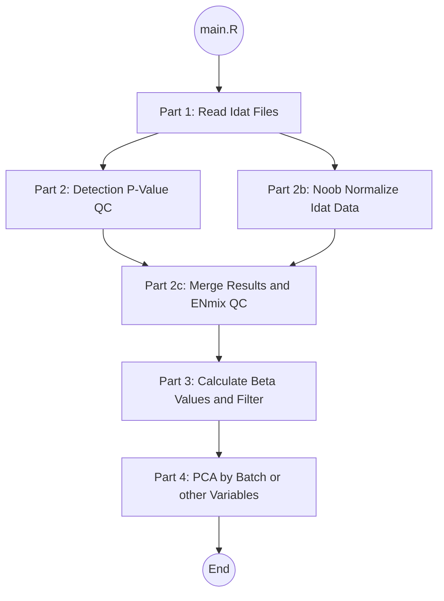

# Methylation Pipeline in R
This is a version of preprocessing Methylation data (no batch correction). This is to help parallelize within R.



# Methylation Preprocessing Pipeline

A modular, restartable preprocessing pipeline for Illumina 450K / EPIC methylation data built on minfi and ENmix.

## How to use

This repository contains a cached, stage‑based methylation preprocessing pipeline designed for reproducibility and batch (i.e. plate number) processing.

### Pipeline overview

The pipeline consists of the following stages:

- **Part 1** — Read IDATs and create per‑batch `RGChannelSet`
- **Part 2** — Per‑batch QC (detection P values, summary metrics)
- **Part 2b** — Per‑batch NOOB normalization
- **Part 2c** — Combine batches and compute ENmix `QCinfo`
- **Part 3** — Extract beta values and apply probe annotation filtering
- **Part 4** — PCA visualization of final beta matrix

Each stage is cached and skipped automatically if outputs exist.

---

## Requirements

- R (≥ 4.2 recommended)
- Required R packages:
  - `minfi`
  - `ENmix`
  - `parallel`
  - `matrixStats`
  - `ggplot2`

Illumina IDAT files must be available in a single directory.

---

## Basic usage

Run the full pipeline with:

```bash
Rscript main.R <sheetname.csv> <datadir> <outdir>
```

## Default of other Options:

```bash
    batches      = [1, 2, 3]
    batch_col    = "Sample_Plate"
    cores        = 8
    meta_cols    = ["Batch"]
    force_part1  = false
    force_part2  = false
    force_part2b = false
    force_part2c = false
    force_part3  = false
    force_part4  = false
```
